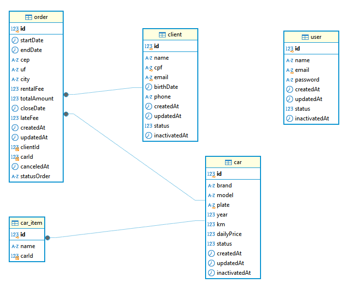

# Projeto: sistema de locação de carros CompassCar

Este projeto é uma API de um sistema de locação de carros da empresa CompassCar. A API oferece ffuncionalidades para gerenciamento de usuários, clientes, carros e pedidos, além de autenticação e autorização, bem como realizar validações nos dados fornecidos.

## Estrutura do Banco de Dados
Abaixo o DER (Diagrama Entidade-Relacionamento) do banco de dados da aplicação


## Orientações para Inicialização

### Requisitos

- **Docker** e **Docker Compose** 

### 1. Clonando o Repositório

1. Clonar o repositório para o seu ambiente local.

   ```bash
   git clone https://github.com/mauroue/ANOUT24_D02_COMPASSCAR_ASYNCNEST.git
   ```

### 2. Cria o arquivo .env na raíz do projeto 

1. Configuração da variaveis de ambiente no arquivo .env

   ```bash
   DATABASE_URL: your_database_url_here
   JWT_SECRET=your_secret_key_here
   DEFAULT_USER_PASSWORD=your_user_passaword
   DEFAULT_USER_EMAIL=your_user_admin_email
   DEFAULT_USER_NAME=admin
   ```

### 3. Subir os serviços 

   ```bash
   docker compose up -d
   ```

## Documentação com Swagger
A documentação dos endpoints da API está disponível via Swagger. Após iniciar a aplicação, você pode acessá-la em:

  ```bash
   http://localhost:3000/api
  ```


